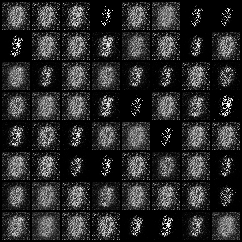
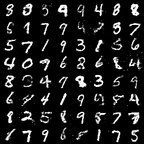
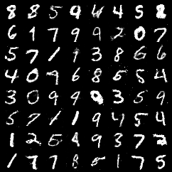
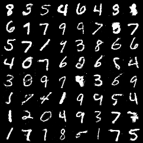

# Learning to Generate Handwritten Digits with GANs (MNIST)

This project implements a **Generative Adversarial Network (GAN)** to generate realistic handwritten digits using the **MNIST** dataset.  
It demonstrates adversarial training between a generator and a discriminator network to synthesize new digit images that closely resemble the original dataset.

---

## Overview

A **Generative Adversarial Network (GAN)** consists of two main models:
- **Generator (G):** Learns to generate fake images that look like real MNIST digits.
- **Discriminator (D):** Learns to distinguish between real and fake images.

As training progresses, the generator improves until the discriminator struggles to tell real from fake samples.

---

## Objectives
- Build and train a GAN on the MNIST dataset.
- Implement the generator and discriminator from scratch using PyTorch.
- Train both networks for **200 epochs**.
- Visualize generated digits at epochs 1, 5, 50, 100, 150, and 200.
- Plot generator and discriminator loss trends.
- Analyze how image quality improves with training.

---

## Model Architecture

### Generator
- **Input:** 100-dimensional random noise vector.  
- **Layers:** Fully connected → Transposed Convolution → BatchNorm → ReLU.  
- **Output:** 28×28 grayscale image using `Tanh` activation.

### Discriminator
- **Input:** 28×28 grayscale image.  
- **Layers:** Convolution → LeakyReLU → Fully Connected → Sigmoid.  
- **Output:** Probability (Real or Fake).

---

## Training Configuration
| Parameter | Value |
|------------|--------|
| Optimizer | Adam |
| Learning Rate | 0.0002 |
| β₁, β₂ | 0.5, 0.999 |
| Batch Size | 128 |
| Epochs | 200 |
| Dataset | MNIST |

**Loss Functions:**
\[
\mathcal{L}_D = -[\log D(x) + \log(1 - D(G(z)))]
\]
\[
\mathcal{L}_G = -[\log D(G(z))]
\]

---

## Results

### Training Loss Plot


> The discriminator loss initially increases as it learns to classify fake samples, while the generator loss decreases as it produces more realistic images.

---

### Generated Digits
| Epoch 1 | Epoch 5 | Epoch 50 |
|----------|----------|----------|
|  |  |  |

| Epoch 100 | Epoch 150 | Epoch 200 |
|------------|------------|------------|
|  |  |  |

> As the GAN trains longer, the digits evolve from blurred patterns to highly legible handwritten digits.

---

## Report
For a complete technical explanation, methodology, and analysis:  
📄 [`GAN_on_MNIST_Report.pdf`](GAN_on_MNIST_Report.pdf)

---

##  How to Run

### 1️⃣ Clone Repository
```bash
git clone https://github.com/<your-username>/Learning-to-Generate-Handwritten-Digits-with-GANs-MNIST.git
cd Learning-to-Generate-Handwritten-Digits-with-GANs-MNIST
```

### 2️⃣ Install Dependencies
```bash
pip install torch torchvision matplotlib numpy
```

### 3️⃣ Run Notebook
```bash
jupyter notebook gan-on-mnist.ipynb
```

Outputs such as generated images and loss plots will be saved automatically in the `outputs/` folder.

---

## Key Takeaways
- Adversarial learning allows the generator to mimic the MNIST data distribution effectively.  
- Generator quality improves steadily with epochs.  
- Balanced updates between G and D are critical to avoid mode collapse or overfitting.  

---

## Author
**Anirudh Krishna**  
Master’s in Applied Machine Learning  
University of Maryland  

---

## Academic Integrity
All code implementation, experimentation, and analysis were performed by the author.  
AI assistance was used solely for grammar, structure, and documentation formatting.  

---

## References
- Goodfellow, I. et al., *“Generative Adversarial Nets,”* NeurIPS 2014  
- Radford, A., Metz, L., & Chintala, S., *“Unsupervised Representation Learning with DCGANs,”* ICLR 2016
